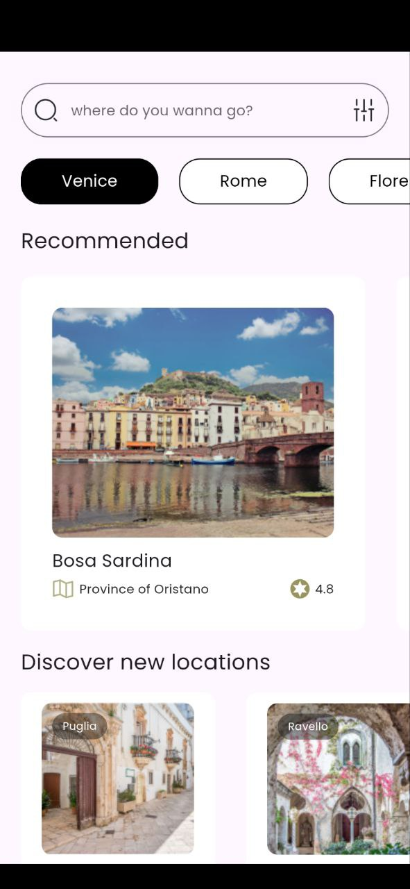

# Flutter Travel App Ui, welcome screen & Home Screen

This Flutter app provides a clean and modern UI for a travel app, the welcome screen and the home screen.

## Features

- **Welcome Screen**: Introduces the app.
- **Home Screen**: Display all the main places.

## Screenshots




## Getting Started

### Prerequisites

- Flutter SDK
- Android Studio or Visual Studio Code

### Installation

1. **Clone the repository**:

    ```sh
    git clone https://github.com/kodjozecodeur/travel-app-ui.git
    ```

2. **Install dependencies**:

    ```sh
    flutter pub get
    ```

3. **Run the app**:

    ```sh
    flutter run
    ```

## Folder Structure

- `lib/`
  - `screens/` - Contains all the screen widgets (home screen, welcome screen).
  - `widgets/` - Reusable UI components like buttons and text fields.
  - `main.dart` - The main entry point of the application.

## Credits

The design of this project belongs to YudhisTira Lucky (@yudhistiralucky):

- [Figma Community](https://www.figma.com/@yudhistiralucky)
- [Contact](yudhistiraluckyoktavian@gmail.com)

## Contact

For any questions or suggestions, feel free to reach out to [samuelmaglodji@gmail.com].
